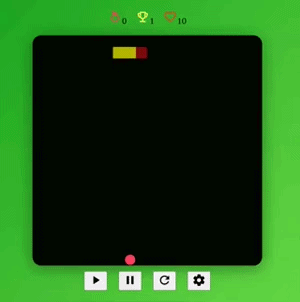

# 🐍 Snake Game

A classic **Snake Game** built with **Vanilla JavaScript, HTML, and CSS**. This project demonstrates fundamental front-end skills, including **DOM manipulation, keyboard input handling, game loops, collision detection, and responsive canvas design**.

---

## 🎯 Features

* Real-time snake movement with keyboard controls (`Arrow keys` + `ZQSD`)
* Collision detection (self-collision and optional walls)
* Food spawning at random positions
* Score tracking, levels, and increasing speed
* Pause and restart functionality
* Responsive design for different screen sizes

---

## 💻 Tech Stack

* **HTML** – Canvas structure and UI
* **CSS** – Styling, gradients, and visual effects
* **JavaScript (Vanilla)** – Game logic, movement, input handling

---

## 🚀 Getting Started

### Clone the repository

```bash
git clone https://github.com/USERNAME/REPO_NAME.git
cd REPO_NAME
```

### Open in browser

Simply open `index.html` in your browser to play the game.

---

## ⚙️ How to Play

* Use **Arrow Keys** or **ZQSD** to control the snake
* Eat the food to grow the snake and increase your score
* Avoid colliding with yourself or (if walls are enabled) the boundaries
* Press **Pause** to pause/resume the game
* Press **Restart** to reset the game

---

## 📌 Notes

* The game speed increases every 5 points scored
* Difficulty levels can be adjusted to change lives and speed
* Optional walls mode can be toggled for added challenge

---

## 📂 Project Structure

```
snake-game/
├─ index.html
├─ style.css
├─ script.js
└─ assets/
```

---

## 🔗 Live Demo



[Live demo](https://alexandredelsol.github.io/Projet-Snake/)

